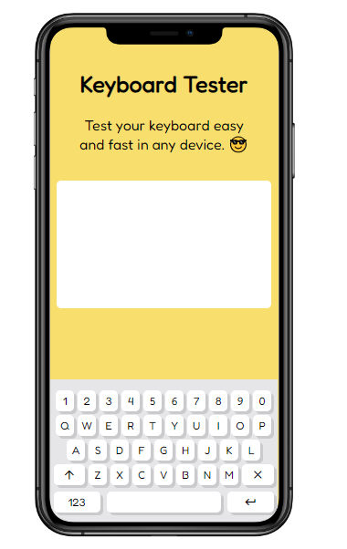

# Keyboard Tester

A keyboard testing application which test all the keys on your keyboard, can be used in desktop tablet and mobile view.
 

 

 

## Objectives

- Testing keys of mobile, tablet, laptop and desktop.

## Getting Started

**Open in VSCode:**
Open the project in VSCode.

**Run Server:**
Run the server by going in the directory 'backend' and run the following commands.

- npm start

**User Interactions:**

- Add a new Task Group.
- View Completed, Incomplete and To be done task groups.
- Initiate a timer for a task group.
- Play Guess My Number game on break timer.
- Switch Dark/Light Mode
